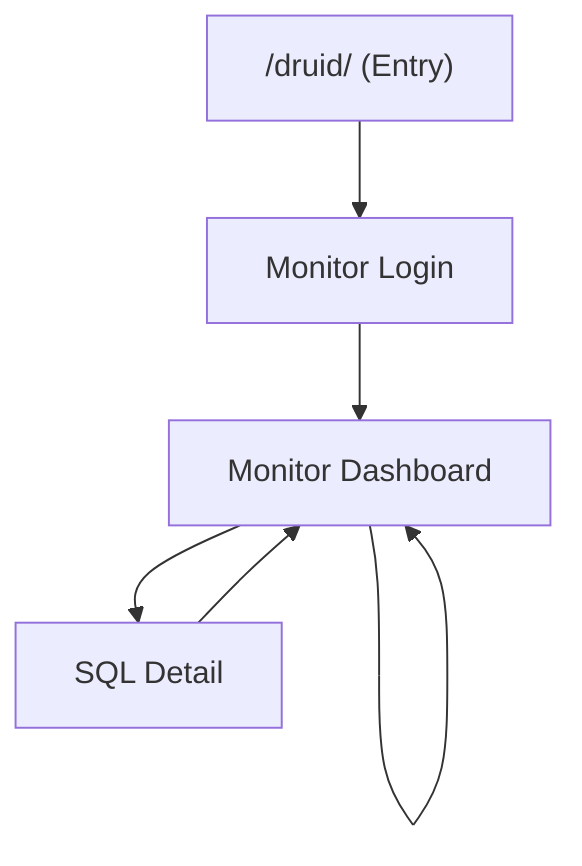

## 1. Product Overview
Bring the current Go “/druid/” replacement up to **feature parity with Java Druid StatViewServlet** (DataSource/SQL/Web) using the same UX patterns and JSON endpoints.
Target users are operators/developers who need production-grade DB + SQL + web-access monitoring with fast troubleshooting.

## 2. Core Features

### 2.1 User Roles
| Role | Registration Method | Core Permissions |
|------|---------------------|------------------|
| Monitor Operator | Log in via monitor username/password (configured by `MONITOR_USER/MONITOR_PASS`) | View all monitoring pages + JSON, trigger reset actions |

### 2.2 Feature Module
1. **Monitor Login**: username/password, error feedback, redirect to dashboard.
2. **Monitor Dashboard**: DataSource metrics, SQL list + sorting, Web URI stats, Web Session stats, reset actions, auto-refresh.
3. **SQL Detail**: per-SQL drilldown (timing, errors, latest samples), navigate back.

### 2.3 Page Details
| Page Name | Module Name | Feature description |
|-----------|-------------|---------------------|
| Monitor Login | Credential form | Validate input, authenticate against configured credentials, create monitor session flag, redirect to Dashboard. |
| Monitor Login | Security controls | Enforce allow/deny (IP allowlist/denylist), rate-limit brute force, show generic error messages. |
| Monitor Dashboard | DataSource (Pool) panel | Display pool configuration + runtime metrics; highlight risky states (high active, long waits, errors). |
| Monitor Dashboard | SQL list panel | Show top SQL by total time / count / max time; support search (by SQL text), sort, pagination; link to SQL Detail. |
| Monitor Dashboard | Web URI panel | Show per-URI request stats (count, errors, latency), plus DB interaction summary per URI. |
| Monitor Dashboard | Web Session panel | List active sessions (create/last access, request count, user identity if available), pagination, forced expire (optional). |
| Monitor Dashboard | Reset actions | Reset all / reset SQL / reset web / reset datasource counters, confirm modal, show success/failure. |
| Monitor Dashboard | Auto-refresh | Toggle auto-refresh, configure interval (e.g., 2s–30s), show “last updated” timestamp. |
| SQL Detail | SQL metadata | Show SQL ID, normalized SQL, first/last seen timestamps, running count/concurrency peak. |
| SQL Detail | Timing & error breakdown | Show execute count, error count, total time, avg/max time, last error sample (message + time). |
| SQL Detail | Sample collection | Show last N executions (duration, error, rows, endpoint/uri correlation if available). |

## 3. Core Process
**Monitor Operator Flow**
1) Open `/druid/` → if not authenticated, redirected to `/druid/toLogin.action`.
2) Login succeeds → redirected to `/druid/` dashboard.
3) Dashboard auto-loads JSON endpoints and refreshes on interval.
4) Operator drills into a SQL item → opens SQL Detail.
5) Operator can reset counters when needed (e.g., after incident).

---

### Java Druid vs Current Go Monitor: Missing Data Points
Your current Go page only shows: **OpenConnections, InUse, Idle, WaitCount, WaitDuration, MaxOpenConnections**.

| Area | Java Druid (expected) | Current Go | Gap |
|------|------------------------|-----------|-----|
| DataSource config | driver/url/username masked, initialSize, maxActive, minIdle, maxWait, validation flags | Not shown | Missing config visibility |
| Pool runtime | active/pooling counts + peaks + timestamps, create/destroy counts, connect/close counts, connect errors, wait thread count | Partial (`Stats()` only) | Missing peaks, connect/error counters, pool history |
| SQL stats (aggregate) | per-SQL: execute count, error count, total/avg/max time, running count, concurrent max, rows (fetch/update), last error sample | None | Entire SQL monitoring missing |
| SQL stats (detail) | SQL ID drilldown, last N samples, error sample/trace (where available), reset per SQL | None | Entire drilldown missing |
| Web URI stats | per-URI: request count, errors, total/avg/max time, concurrent max; JDBC call counts/time aggregated per URI | None | Entire web monitoring missing |
| Web Session stats | session list, create/last access, request counts, user principal, remote addr (where available) | None | Entire session monitoring missing |
| Reset endpoints | reset-all / reset-sql / reset-web / reset-datasource | None | Missing operational controls |
| JSON endpoints | datasource.json / sql.json / weburi.json / websession.json / reset*.json | None | Missing parity APIs |
| Auto refresh UX | built-in periodic AJAX refresh | None | Missing realtime behavior |
