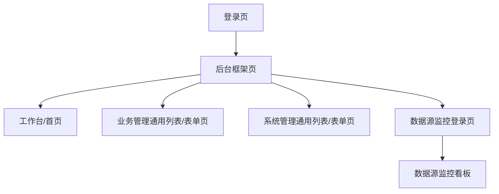

## 1. Product Overview
对现有后台管理前端进行全站视觉统一与品质提升（配色/字体/间距/圆角/阴影/组件状态）。
在不改变现有功能、交互逻辑与 `.action` 路由（含 iframe 标签页机制）的前提下，输出可落地的改造范围与验收标准。

## 2. Core Features

### 2.1 Feature Module
本次视觉优化覆盖以下核心页面/对象：
1. **登录页**：品牌化主视觉、表单/按钮/验证码区统一、错误提示样式统一。
2. **后台框架页（顶部/侧边/标签页容器）**：统一主色与导航状态、标签页/操作区/布局留白、全局背景与卡片容器。
3. **工作台/首页**：信息卡片、快捷入口、列表模块统一卡片化与层级。
4. **通用列表/表单页（业务管理与系统管理）**：表格、筛选区、工具条、分页、弹窗表单统一组件风格。
5. **数据源监控（Druid 登录/看板）**：与系统蓝白风格一致的登录体验与容器样式，不改变监控功能。

### 2.2 Page Details
| Page Name | Module Name | Feature description |
|---|---|---|
| 登录页（`system/main/login.jsp`） | 视觉主调与布局 | 统一背景/卡片/阴影/圆角；保持原表单结构与提交行为不变。 |
| 登录页 | 表单组件统一 | 统一输入框高度、聚焦/校验态、按钮主次层级；验证码图片容器与边框一致。 |
| 后台框架页（`system/main/index.jsp`） | 全局主题令牌 | 定义并应用主色/中性色/语义色/圆角/阴影/字号/间距等 CSS 变量；避免影响现有 class 与选择器。 |
| 后台框架页 | 导航与标签页 | 统一顶部渐变、侧边栏选中/展开/hover、tab 选中态与关闭操作区；不改变菜单加载与 iframe 机制。 |
| 工作台（`desk/toDeskManager.action` 页面） | 卡片与信息层级 | 统一卡片容器（标题/副标题/数值/图标）与列表模块样式；保持数据接口与点击跳转不变。 |
| 通用列表/表单页（如车辆/客户/出租/检查/用户/角色/日志/公告/留言等） | 表格/筛选/工具条 | 统一筛选区布局与按钮组；统一表格表头/斑马纹/hover/空态；统一分页密度与点击态。 |
| 通用列表/表单页 | 弹窗/抽屉/提示 | 统一 Layer 弹窗标题区/按钮区/危险操作提示；统一 success/warn/error 提示色与 icon；不改变 JS 调用方式。 |
| 数据源监控（`system/druid/*`） | 登录与容器适配 | 登录框居中与遮罩风格与系统一致；监控页仅做外层容器/字体/背景适配，不干预内部图表与交互。 |

## 3. Core Process
- 你登录系统后进入后台首页（工作台），通过左侧菜单打开业务/系统页面（以 iframe 标签页呈现）。
- 你在列表页进行查询、分页、增删改查；弹窗表单、提示与确认对话框保持原逻辑，仅视觉一致化。
- 你可进入“数据源监控”，若未登录按现有流程进入其登录页；登录后查看监控看板。

### 可落地改造范围（约束）
- 允许：新增/调整站点级 CSS（优先“追加覆盖”）；少量为挂载样式所需的 class 增补（不改 DOM 结构与事件绑定）。
- 禁止：修改 `.action` 路由、菜单 JSON 地址、iframe/tab 机制、表格/表单的字段与提交逻辑。

### 验收标准（UAT）
1. **无路由变更**：所有页面入口与 Ajax 接口地址保持一致（含 `${yeqifu}` 前缀规则）。
2. **无功能回归**：登录、菜单加载、tab 打开/刷新/关闭、列表查询/分页/新增/编辑/删除、上传/验证码等流程可用。
3. **一致性**：主色/文字色/边框/圆角/阴影/按钮/输入框/表格/弹窗在主要页面表现一致。
4. **可读性**：标题/正文/辅助文案层级清晰；对比度满足日常可读（深色文字在浅底）。
5. **兼容性**：Chrome/Edge/Safari（16+）下布局无明显错位；常见分辨率（≥1366）无横向滚动条（业务表格除外）。
6. **性能**：新增 CSS 不引入明显卡顿；首屏不增加大型图片依赖（登录背景除外，需可缓存）。
