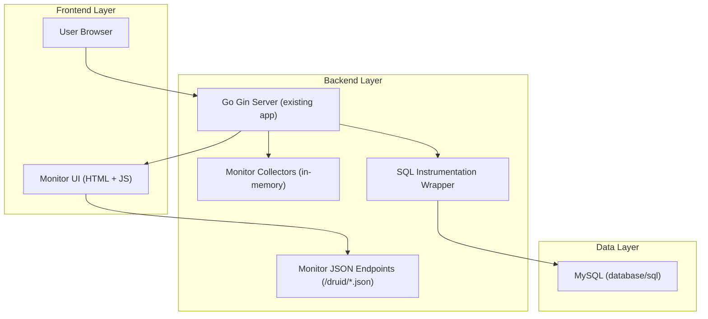
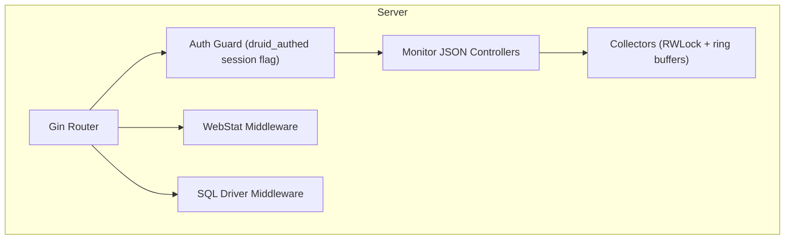

## 1.Architecture design


## 2.Technology Description
- Frontend: Server-rendered HTML (existing view system) + vanilla JS (fetch + setInterval) + existing CSS assets
- Backend: Go + gin-gonic/gin + gin-contrib/sessions
- Database: MySQL via `database/sql` + `github.com/go-sql-driver/mysql`

## 3.Route definitions
| Route | Purpose |
|-------|---------|
| /druid/toLogin.action | Monitor login page (existing) |
| /druid/login.action | Monitor login submit (existing) |
| /druid/logout.action | Monitor logout (existing) |
| /druid/ | Monitor dashboard page (to be upgraded to Druid-like UI) |
| /druid/index.html | Redirect to /druid/ (existing) |
| /druid/datasource.json | DataSource/pool stats (new) |
| /druid/sql.json | SQL aggregate list + query/sort/pagination (new) |
| /druid/sql-{id}.json | SQL detail by SQL ID (new) |
| /druid/weburi.json | Web URI stats (new) |
| /druid/websession.json | Web session stats (new) |
| /druid/reset-all.json | Reset all counters (new) |
| /druid/reset-sql.json | Reset SQL counters (new) |
| /druid/reset-web.json | Reset web uri/session counters (new) |
| /druid/reset-datasource.json | Reset datasource/pool counters (new) |

## 4.API definitions (If it includes backend services)
### 4.1 Core Types (TypeScript-style for shared understanding)
```ts
type DataSourceJSON = {
  name: string;
  dbType: "mysql";
  jdbcUrlMasked: string;
  userMasked: string;
  initialSize?: number;
  maxActive?: number;
  minIdle?: number;
  maxWaitMs?: number;
  // runtime
  openConnections: number;
  inUse: number;
  idle: number;
  waitCount: number;
  waitDurationMs: number;
  // druid-like additions collected in Go
  connectCount: number;
  connectErrorCount: number;
  closeCount: number;
  activePeak: number;
  activePeakTime?: string;
};

type SQLItem = {
  id: string;              // stable hash of normalized SQL
  sql: string;             // normalized SQL
  executeCount: number;
  errorCount: number;
  runningCount: number;
  concurrentMax: number;
  totalTimeMs: number;
  avgTimeMs: number;
  maxTimeMs: number;
  lastErrorMsg?: string;
  lastErrorTime?: string;
  firstSeen: string;
  lastSeen: string;
};

type SQLListJSON = {
  items: SQLItem[];
  total: number;
  page: number;
  pageSize: number;
  sortBy: "totalTimeMs"|"executeCount"|"maxTimeMs"|"errorCount";
  query?: string;          // substring match on SQL
};

type SQLDetailJSON = {
  item: SQLItem;
  samples: Array<{
    ts: string;
    durationMs: number;
    ok: boolean;
    errMsg?: string;
    rowsAffected?: number;
    uri?: string;          // if correlated to request
  }>;
};

type WebURIItem = {
  uri: string;             // prefer gin.FullPath() fallback to raw path
  requestCount: number;
  errorCount: number;
  runningCount: number;
  concurrentMax: number;
  totalTimeMs: number;
  avgTimeMs: number;
  maxTimeMs: number;
  jdbcExecuteCount: number;
  jdbcErrorCount: number;
  jdbcTotalTimeMs: number;
};

type WebURIJSON = { items: WebURIItem[]; total: number; page: number; pageSize: number; };

type WebSessionItem = {
  sessionKey: string;      // hash of cookie value (no plaintext)
  user?: string;           // loginname if present
  createTime: string;
  lastAccessTime: string;
  requestCount: number;
  remoteAddr?: string;
};

type WebSessionJSON = { items: WebSessionItem[]; total: number; page: number; pageSize: number; };
```

### 4.2 Collection & Parity Strategy (How Go matches Druid)
1. **DataSource/Pool**
   - Use `db.Stats()` for OpenConnections/InUse/Idle/WaitCount/WaitDuration.
   - Add additional counters and peaks in Go:
     - activePeak/activePeakTime from observing `InUse` over time.
     - connectCount/closeCount/connectErrorCount by wrapping driver `Open`/`Conn` lifecycle (see SQL instrumentation).

2. **SQL Monitoring** (critical gap)
   - Implement a `database/sql` driver middleware (recommended: wrap the MySQL driver) to intercept:
     - Exec/Query/QueryRow/Prepare + duration + error + rows.
   - Normalize SQL (collapse whitespace, optionally strip literals) to mimic Druid “merged SQL”.
   - Generate SQL ID = stable hash (e.g., FNV-1a hex) of normalized SQL.
   - Maintain per-SQL aggregation + last-N samples (ring buffer) + running/concurrency tracking.

3. **Web URI Monitoring**
   - Add a Gin middleware that captures:
     - start/end time, status code, route pattern, remote IP.
   - Correlate DB activity to the request:
     - request context stores “jdbcExecuteCount/jdbcErrorCount/jdbcTotalTimeMs” updated by SQL middleware.

4. **Web Session Monitoring**
   - Track sessions via the cookie value of `carRental.sid` (hash before storing).
   - On each request, update lastAccessTime and requestCount; attach user identity if logged in.

5. **Reset Endpoints**
   - Provide reset endpoints matching Druid naming; require monitor auth.
   - Reset implemented as: swap collector instances or clear maps under a lock.

## 5.Server architecture diagram (If it includes backend services)


## 6.Data model(if applicable)
No persistent database tables are required; all monitoring data is kept in memory with bounded size:
- Top-N SQL items (e.g., 500) + per-item last-N samples (e.g., 50)
- Top-N URIs (e.g., 200)
- Sessions (e.g., 2,000) with TTL eviction

### Testing Plan (Go)
- **Unit tests**
  - SQL normalization + ID stability
  - SQL aggregator math (avg/max/total), concurrency counters
  - WebStat aggregator (latency, error counting)
- **HTTP integration tests (httptest)**
  - Auth required: all `/druid/*.json` redirect/403 when not authed
  - JSON schema sanity: required fields present
  - Auto-refresh friendly: endpoints respond fast and are side-effect-free
- **Race tests**
  - `go test -race` for collectors under concurrent request simulation
