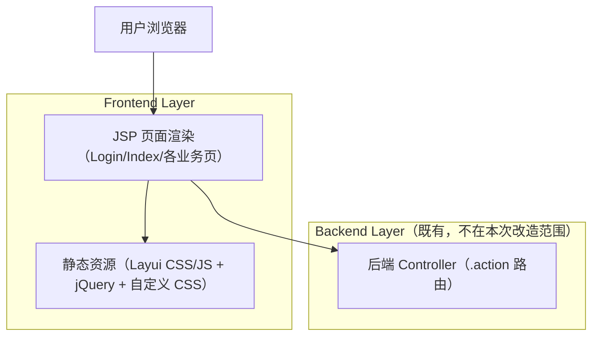

## 1.Architecture design

## 2.Technology Description
- Frontend: JSP（服务端渲染） + Layui + jQuery + 自定义 CSS（`static/css/index.css`、`static/css/public.css`）
- Backend: 既有 `.action` 路由体系（保持不变）

## 3.Route definitions
| Route / Entry | Purpose |
|---|---|
| `/login/login.action` | 登录提交（表单 POST），成功后进入后台框架页 |
| `/login/getCode.action` | 获取验证码图片 |
| `/desk/toDeskManager.action` | 工作台/后台首页 iframe 默认内容 |
| `/menu/loadIndexleftMenuJson.action` | 获取菜单 JSON（用于渲染左侧菜单与 tab 打开） |
| `/sys/toChangePassword.action` | 修改密码页（在 tab/iframe 内打开） |
| `system/druid/*`（如 `druidLogin.jsp` / 监控入口） | 数据源监控登录与看板入口（保持现有流程） |

## 4.API definitions (If it includes backend services)
本次为纯前端视觉改造，不新增后端 API；仅要求现有接口地址与入参/出参保持完全一致。

## 6.Data model(if applicable)
不涉及。

### 前端改造落地策略（不改功能/路由）
1. **CSS 追加覆盖优先**：新增一份站点主题样式（建议如 `static/css/theme.css` 或 `ui-overrides.css`），在 `layui.css` 与既有 CSS 之后加载；减少对原文件的大范围重写。
2. **设计令牌（Design Tokens）**：以 CSS 变量落地（项目中已出现 `--ui-primary/--ui-bg/...` 的雏形），将颜色/间距/圆角/阴影/字体统一为可复用变量。
3. **组件级覆盖以 Layui 选择器为主**：覆盖按钮、表单、表格、分页、Tab、Layer 弹窗等核心组件的视觉（hover/active/disabled/focus/校验态）；不改变 Layui 初始化与事件绑定。
4. **最小 DOM 侵入**：若必须加挂载点，仅新增 class，不改层级结构、不改 id、不改表单 name、不改 `data-url` 等依赖字段。
5. **回滚与隔离**：所有新样式集中在单一文件，可通过移除引用快速回滚；避免在业务页散落 `!important`。
